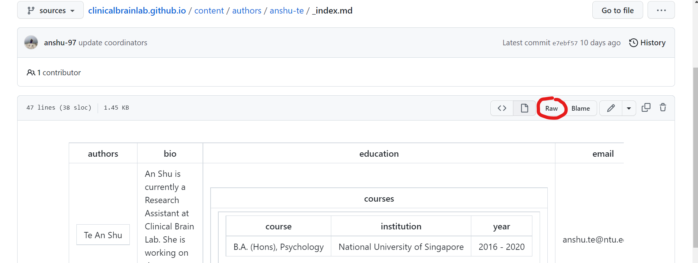
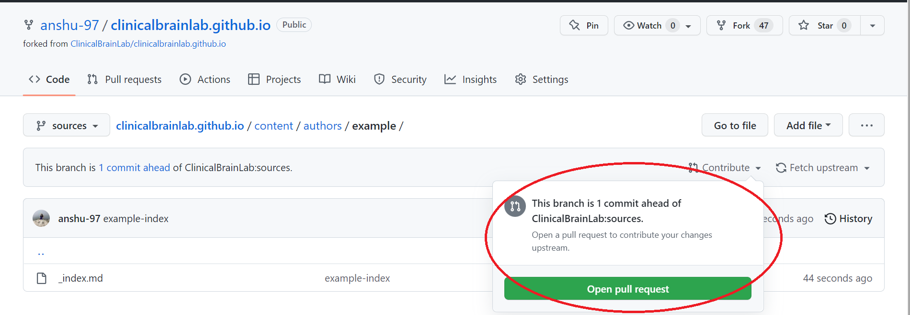
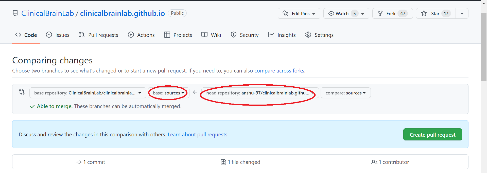

# Clinical Brain Lab Website

This repository contains the code to host the Clinical Brain Lab website: http://www.clinicalbrain.org ✨

## Getting Started with GitHub :memo:
- Create an account for yourself (*use a simple login like FirstnameSurname*)
- [Github Guides](https://guides.github.com/)
- [How to use Github to contribue](https://neurokit2.readthedocs.io/en/latest/contributing/contributing.html#how-to-use-github-to-contribute)
- [How to create a Pull Request](https://www.earthdatascience.org/courses/intro-to-earth-data-science/git-github/github-collaboration/how-to-submit-pull-requests-on-github/)
- [Github Cheatsheet](https://github.com/tiimgreen/github-cheat-sheet)
- [Markdown Introduction](https://guides.github.com/features/mastering-markdown/)
  - Note that on GitHub, we write in **markdown**, which is a set of conventions allowing to quickly and easily format text (e.g., text in bold, italic, titles, etc.).

## Setting up your Profile :woman: :man:

- **Step 1: Fork the website repository**
  - Hit the **fork** button at the top right corner to make a *copy* of the repository in your Github account.

    

   -  After a few minutes of waiting, you should now see a repository with a name of `your-username/clinicalbrainlab.github.io`.
   
   

 - **Step 2: Add your profile to the website**
   - In your newly *copied* repository, navigate to the folder `your-username/clinicalbrainlab.github.io/content`. This is where all the content of the website is stored.
   - Can you guess which folder is the one storing the profiles of our lab members? By intuition or by try-and-error, you should now click on the `authors` folder. Here you will find each folder for each of our lab members. Now your task is to create one for yourself!
   
   
   
   - First step: copy the url of the `authors` folder and open it in another tab. Have the two tabs side-by-side and from now on, we refer to them as `tab-left` and `tab-right`. Both of them are now at `your-username/clinicalbrainlab.github.io/content/authors`.
   - Second step: now, for `tab-left`, open the folder of any lab member that you would like to a take reference from. You will see 2 files in the folder: a filed called `_index.md` and a picture file named `avatar.png`. 
   
   
   
   - Click on the `_index.md` file and click on the button `Raw` on the top right-hand corner. You should now see a plain file that looks like any other text files. Please copy the entire content of the `_index.md` file (hightlight everything and Ctr-C).
   
   
   
   - Third step: so far, you have been working on `tab-left`. You will now need to go to `tab-right` and create a new folder for yourself. Make sure that `tab-right` is at `your-username/clinicalbrainlab.github.io/content/authors`. Look for the button `Add files` at the top right-hand corner, click on it and choose `Create new file`. In the box `Name your file ...`, please type the following: "yourfirstname-yourlastname/_index.md". As an example, I have named this new file as "Tam-Pham/_index.md". Do not leave any space in the name. 
 
       
 
   - Fourth step: remember you copied the content of `_index.md` file of another member in second step? Now, you should paste everything in the `Edit new file` space. By reading through what you have just copied, you will see that the file contains a a number of sub-headings.
   
   
   
   - Now, to make this `_index.md` file yours, you need to customize the content (*the order of the sub-headings doesn't matter):
        - *title*: your name (to appear in the Team members tab in home page). Full name is preferred here
        - *user_groups*: The user_group can be "Principal Investigator", "Research Scientists and Research Fellows", "Graduate Students","Research Assistants", "Undergraduate Students","Alumni","System Administrators". Please indicate the group that you belong to. 
        - *authors*: this name will be presented whenever the author is referred to in the website (e.g. in publication, projects). Use the name that you use for your publications.
        - *bio*
        - *education*
        - *email*
        - *interests*
        - *organization*
        - *role*
        - *social*: your contacts. Can be more or less than those in the template. But the basic ones are email, researchgate and orcid
        - *superuser*: false for all
        - Below the "---" is where you can write a short intro about yourself.
    - After you have finished making all the edits, scroll to the bottom and hit the green button `Commit changes`. This will save all the changes that you just made to your `_index.md` file.
    
    
    
    - Now, in `your-username/clinicalbrainlab.github.io/content/authors`, you should see a new folder that you just created with an `_index.md` file.
  - **Step 3: Add your profile picture**
    - The very last step for you to customize your profile is to add a picture of yourself.
    - Look for that one picture of yourself that you look the most amazing 😊. In the next step, you will upload this photo to the website. However, before you upload your photo to your folder, remember to rename it to `avatar.png`.
    - To upload your folder to this new folder that you have created, click on `Add files` again but this time, choose `Upload files`. 
    - Upload the `avatar.png` file, hit the button `Commit changes` and that's it. You have finished creating a folder for yourself and customized it!

  - **Step 4: Make a Pull Request**
    - You are almost finished! Go back to `your-username/clinicalbrainlab.github.io` main page to look for the *Pull Rquest* sign. Click on it.

      

    - The page will show that you are trying to make a Pull Request from **your** repositorty *"your-username/clinicalbrainlab.github.io"* to the **original** repository *clinicalbrainlab/clinicalbrainlab.github.io"*. Please make sure that the base is `sources`.
    
    
    
    - All the left for you to do is to click on that shiny green button to update your changes to the original repository.

Congratulations! You have successfully updated your profile on our website!

## To-Do: Migrate content of website to new Academic Hugo Theme :heavy_check_mark:

- [x] Backbone of the website
- [x] Finalize lab members' profiles
- [x] Add alumni list (for a new page, not to be shown on home)
- [x] Finalize full list of publications
- [x] Projects organized
- [ ] Projects elaborated
- [x] Finalize `Contact` section
- [x] Update `Join` section
- [x] Tab for `Software Development` (Add details as we go on)
- [ ] Finalize Resources for Parents/kids
- [ ] Finalize gallery

